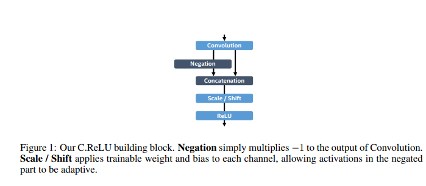
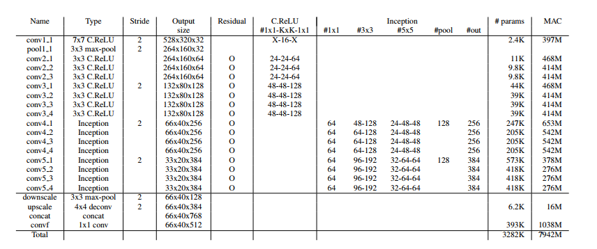
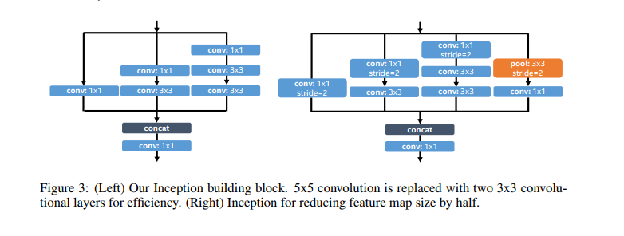
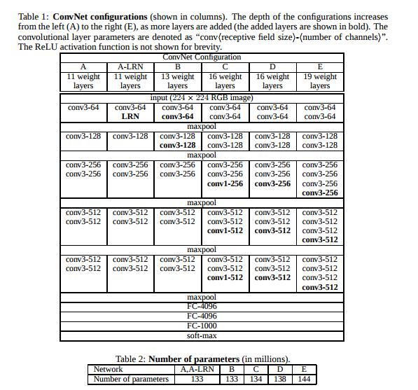
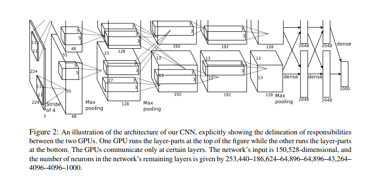
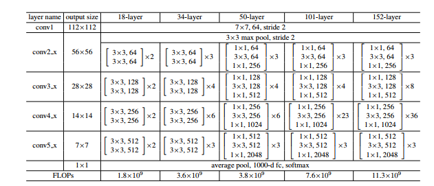
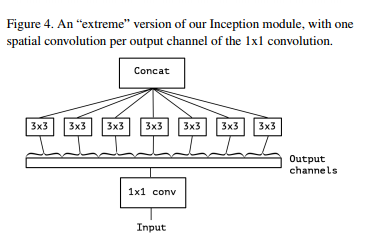
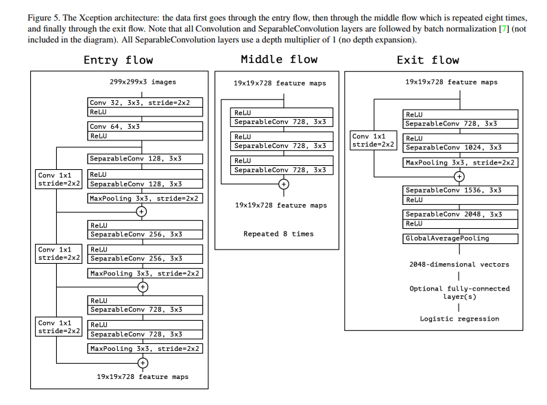
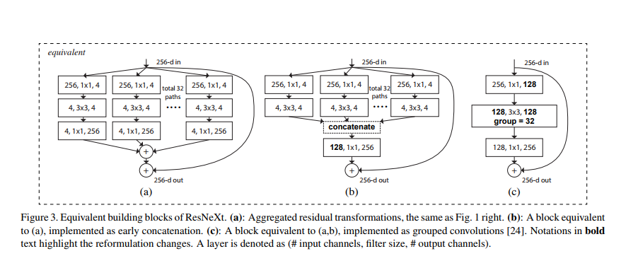
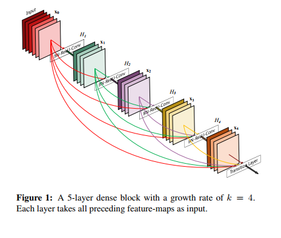

##[pvanet](http://cn.arxiv.org/pdf/1608.08021v3)

* 1065 x 640 input,
* Theoretical computational cost is given as the number of adds and multiplications (MAC) 7.9G,  ResNet-101 80.5GMAC
* All conv layers are combined with batch normalization, channel-wise scaling and shifting, and ReLU activation layers.
* param_size        12.642 MiB total_flops       509.411 MiOPs (224x224x3)

##[vgg](http://cn.arxiv.org/pdf/1409.1556v6)

* vgg16 and vgg19 (13 conv (2-2-3-3-3, 16conv 2-2-4-4-4, both with 3 FC)
* 548.159 MiB parameter size(floating point), 18.284 GiOPs at input size (224x224x3)

## [alexnet](https://papers.nips.cc/paper/4824-imagenet-classification-with-deep-convolutional-neural-networks.pdf)

* large conv large stride in first layer
* actually is a half group conv version
* use ReLu
* param_size        237.980 MiB  total_flops       2.840 GiOPs (224x224x3)

## [Resnet](http://cn.arxiv.org/pdf/1512.03385v1)
* bottleneg structure

## [Xception](http://cn.arxiv.org/pdf/1610.02357v3)
* resnet structure and seperable conv (channel wise conv)

## [Resnext](http://cn.arxiv.org/abs/1611.05431)
* group conv and bottleneg

## [densenet](http://cn.arxiv.org/pdf/1608.06993v4)

## [shuffletnet](http://cn.arxiv.org/pdf/1707.01083v1)

