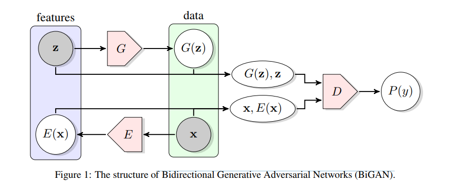

* [Adversarial Feature Learning](http://cn.arxiv.org/pdf/1605.09782.pdf)

Supervised learning ignores much of the useful information present in the structure of the data itself.

GAN trained on a database of
human faces learns to associate particular latent directions with gender and the presence of eyeglasses. [UNSUPERVISED REPRESENTATION LEARNING WITH DEEP CONVOLUTIONAL GENERATIVE ADVERSARIAL NETWORKS](http://cn.arxiv.org/pdf/1511.06434v2)

can GANs be used for unsupervised learning of rich feature representations for arbitrary data distributions?

* [Adversarial Feature Learning](http://cn.arxiv.org/pdf/1605.09782.pdf)

this is note2
