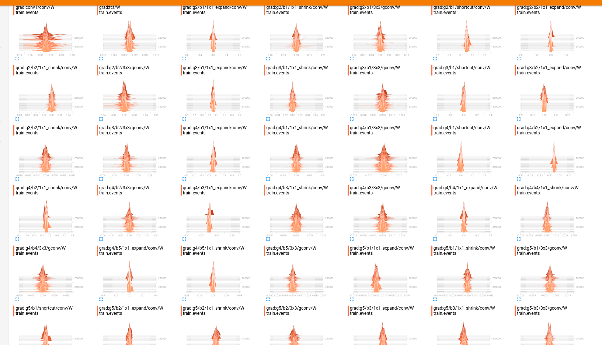
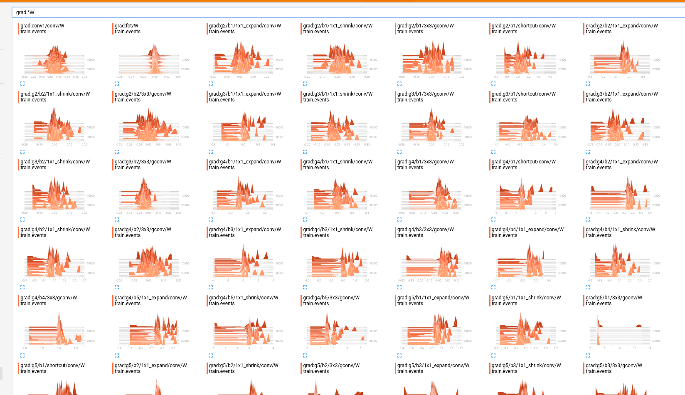

## 2017.10.17
### Done
* 协助sunlei在南北区采集攻击case
* 完成koala每日监控，图片收集
* inverse feature work log记新实验

### TODO
10%FN done
idea: total variance in grad


## 2017.10.18
* face unlock small face and dynamic face crop( smartian photo not done)
* foreground and background dataset(download done)
* sythsis dataset(sureal)  working on get-started example, can not run the game binary
* help huang to bootstrap brain++ and neupeak(done)

## 2017.10.19
* face unlock small face and dynamic face crop(setup, crop size 3.0 work much better than 2.0)
* update monitor(split file into different folders)
* koala new idea crop human(need to push sunlei to record the whole image) human shape koala
* bezier curve fitting first try

## 2017.10.20

* koala different activation function [BRIDGING NONLINEARITIES AND STOCHASTIC REGULARIZERS
WITH GAUSSIAN ERROR LINEAR UNITS](https://openreview.net/pdf?id=Bk0MRI5lg)
* face unlock traing 数据， benchmark 彻底尝试混合扣脸策略，解决大屏（纸）小脸问题
* koala 重新启动采集训练数据（pad and 纸）
* 记bezier curve fitting worklog
* 看一下STR work log

## 2017.10.21
* 动态抠脸（脸太小的抠得大一些）
* 用模型最后的抠脸测略finetune 模型，掉点！！（不科学）

## 2017.10.23
### koala
* koala 加数据
	* face id online data
	* collected
	* iphone panorama
	* 试一下加玻璃数据overfit??
* 调研koala monitor 结果的诡异之处
* koala 8bit replace_dict bug fixed, and try tanh and relu (finetune or not) experiments
* sunlei 400段活人视频 测一下 过质量判断 megface pose blur 的图
* idea: sythetic data for human action liveness
* quantize_weight [worklog](https://docs.google.com/document/d/1KV-_eZ3pYTi6B4Go8Ut52LXGafBHtrUooCS8ooyD1xs/edit)
```python
bit_width = O.shared('bit_width', np.array([8, 8]))

def quantize_w(x, num_bit=0):
    if num_bit == 0:
        num_bit = bit_width[0]

    x = O.set_grad(x, None)
    scale = O.abs(x).mean() * 2
    y = round_bit(O.clip(x / scale, -0.5, 0.5), num_bit=num_bit) * scale
    x.set_grad_var(O.grad_wrt(y))
    return y


def round_bit(x, num_bit):
    x = O.set_grad(x, None)

    max_val = 2 ** num_bit - 1
    y = (((x + 0.5) * max_val + 0.5) // 1) / max_val - 0.5

    x.set_grad_var(O.grad_wrt(y))
    return y
```

* [robotic work log](https://docs.google.com/a/megvii.com/document/d/1rzPSTBskdHLe7SEXmeqIrbJ5tWS8M-Q6rFyJbPwSjlo/edit?usp=drive_web)


### compression

npk-prune-weight
npk-cluster-weight
npk-huffman-weight

## 2017.10.24
* facepass must run at single core, current 8000+image fp 25
* train koala model using new collected data(1024)
* read deep compression
* refactor STR code,

## 10.25

## 10.26
match crop_face v2 score

## 2017.10.25
* deep compresion experiment and tool
    * alexnet and face unlock
* data list weight backprop

## 2017.10.28
* replay attack data v2
* know something about keras. and replement attack data gen using neupeak
* model_pred.py model.py 要注意

## 2017.11.03
### bodao 1101
* koala genuine data不能加
* remove baidu poision (blue face)
* more attack data

## 三模型
＠sunlei
三个模型combine在/home/liangjiajun/lyxd/model/koala_release/bodao_171107/hako,
其中panorama.koala.1107_shuffnet1 和panorama.koala.1107_shuffnet2为小模型，panorama.koala.1107_pvanet900为大模型，大模型可能要上GPU.

combine的测略是把三个模型的输出平均即可，活人阈值可以参考下表的threshold一列.(大于该值为活人)

## 抠脸测略
抠脸策略已经同步到@yufei

## 关于质量判断对结果的影响
目前有两种方法去过滤掉一些＂不好＂的脸，**一个是扔掉小脸，二是扔掉大pose大blur脸**．两种方法我分别称他们为minface和quality, 下面枚举不同minface面积和是否具有quality的不同测略组合．可以看到在卡130x130, 同时具备pose blur quality的测略在FP千一和百一下均具有较好的结果．（其中pose和blur分别卡30度和0.5)

#### FP千一，检出率最佳为93.5%
| fname                         | minface   |   quality |      TPR |        FPR |   attack |   genuine |   threshold |
|:------------------------------|:----------|----------:|---------:|-----------:|---------:|----------:|------------:|
| koala_1107_3model_combine.txt |           |           | 0.869697 | 0.00115798 |     3630 |      6045 |    0.301772 |
| koala_1107_3model_combine.txt | 100x100   |           | 0.876011 | 0.00109379 |     2597 |      3657 |    0.316853 |
| koala_1107_3model_combine.txt |           |         1 | 0.876064 | 0.00104668 |     2937 |      4777 |    0.318693 |
| koala_1107_3model_combine.txt | 110x110   |           | 0.883978 | 0.00112486 |     2353 |      3556 |    0.316853 |
| koala_1107_3model_combine.txt | 120x120   |           | 0.895207 | 0.00118941 |     2128 |      3363 |    0.316853 |
| koala_1107_3model_combine.txt | 100x100   |         1 | 0.897609 | 0.00130166 |     2217 |      3073 |    0.382695 |
| koala_1107_3model_combine.txt | 110x110   |         1 | 0.902293 | 0.001001   |     2006 |      2997 |    0.376741 |
| koala_1107_3model_combine.txt | 130x130   |           | 0.910363 | 0.00132188 |     1930 |      3026 |    0.316853 |
| koala_1107_3model_combine.txt | 140x140   |           | 0.912    | 0.00117325 |     1750 |      2557 |    0.311353 |
| koala_1107_3model_combine.txt | 150x150   |           | 0.914867 | 0.00149551 |     1574 |      2006 |    0.311353 |
| koala_1107_3model_combine.txt | 120x120   |         1 | 0.914882 | 0.00105411 |     1821 |      2846 |    0.376741 |
| koala_1107_3model_combine.txt | 150x150   |         1 | 0.922571 | 0.0011422  |     1369 |      1751 |    0.316853 |
| koala_1107_3model_combine.txt | 130x130   |         1 | 0.930514 | 0.00116144 |     1655 |      2583 |    0.382695 |
| koala_1107_3model_combine.txt | 140x140   |         1 | **0.935804** | 0.00136116 |     1511 |      2204 |    0.382695 |


#### FP百一，检出率最佳为98.06%

| fname                         | minface   |   quality |      TPR |       FPR |   attack |   genuine |   threshold |
|:------------------------------|:----------|----------:|---------:|----------:|---------:|----------:|------------:|
| koala_1107_3model_combine.txt |           |           | 0.952617 | 0.010091  |     3630 |      6045 |    0.597275 |
| koala_1107_3model_combine.txt |           |         1 | 0.953013 | 0.0100481 |     2937 |      4777 |    0.602012 |
| koala_1107_3model_combine.txt | 100x100   |           | 0.958414 | 0.0101176 |     2597 |      3657 |    0.609198 |
| koala_1107_3model_combine.txt | 110x110   |         1 | 0.96012  | 0.01001   |     2006 |      2997 |    0.609212 |
| koala_1107_3model_combine.txt | 100x100   |         1 | 0.962111 | 0.0100879 |     2217 |      3073 |    0.626674 |
| koala_1107_3model_combine.txt | 110x110   |           | 0.962176 | 0.0101237 |     2353 |      3556 |    0.608062 |
| koala_1107_3model_combine.txt | 120x120   |         1 | 0.9676   | 0.0101897 |     1821 |      2846 |    0.608062 |
| koala_1107_3model_combine.txt | 120x120   |           | 0.968045 | 0.01011   |     2128 |      3363 |    0.604542 |
| koala_1107_3model_combine.txt | 130x130   |           | 0.974611 | 0.0102445 |     1930 |      3026 |    0.609212 |
| koala_1107_3model_combine.txt | 140x140   |           | 0.974857 | 0.0101682 |     1750 |      2557 |    0.597275 |
| koala_1107_3model_combine.txt | 150x150   |           | 0.975222 | 0.0104686 |     1574 |      2006 |    0.598017 |
| koala_1107_3model_combine.txt | 140x140   |         1 | 0.976837 | 0.0104356 |     1511 |      2204 |    0.608062 |
| koala_1107_3model_combine.txt | 150x150   |         1 | 0.978086 | 0.0102798 |     1369 |      1751 |    0.608062 |
| koala_1107_3model_combine.txt | 130x130   |         1 | **0.98006**  | 0.0100658 |     1655 |      2583 |    0.626674 |

## 2017-11-09
weight pruning grad


share weight grad


try really small learning rate
try different kmean stragery
weight decay
checkpoint optimization state

## 11.10
debug kmean
try quantize weight
distill model

## 11.18
- surreal data runnable, 3d human action video sythesis
- get chenxi lowbit work log and example code
- jrh bootstrap koala
- combine two shuffle net model and test speed, send to sunlei
- test bm data

## 11.21
- learn surreal data generation code

## 12.04
- try multi layer classifier (for jrh)
- switch chanmean to fc
- feature analysis for jrh（SVD）？
- compression remove bn first
- train large model

## 2018.01.02
### data


### clean
华为data 活人 clean

#### copy
renzhegnji  171222 (rsync eta 1.2 12PM) tmux 11
orbec/20171219 tmux orbec eta  24*3.... tmux 8
huawei_convert eta 5:30 scp ing


#### use
renzhengji local read'
vivo 红外

### model
一定要跑起来一个红外model

### research
koala direction.
dkf GAN direction

install NPM:
http://nodejs.cn/download/

## 2018.01.03
renzhengji process
vivo process
huawei
奥比
haikang

## 2018.01.04
把数据弄好，
树莓派
开搞C50PA(plan)
短视频活体，双角度活体

## 2018.01.05
把数据弄好，
树莓派
开搞C50PA
短视频活体，双角度活体

## 2018.01.08
C50PA on raspberry
adversial koala on raspiberry pi

## 2018.01.08
8PC 数据（收两PC） done
liyang haikang data doing
树莓派稳定化 seem done

## 2018.01.10
sd卡烧制中　done
jrh 对抗采集 done

##2018.01.11
pairing example
boundary optimization network

## 2018.01.15
整理了数据状态 and work log 状态（求填）

## 2018.01.16
END-TO-END DETECTION-SEGMENTATION NETWORK WITH ROI CONVOLUTION
dictionary learning
ROI convolution

## 2018.01.17
end to end liveness 

## 2018.01.18
raspberry talk
end to end liveness cont.
huawei data (error processing)
youyi hospital data (still taring)
cvpr18 paper review 1.25 deadline (experiment setup)

## 2018.01.22
koala rgb release new version (crop face inside)

### 2018.01.23
koala model release
mongodb: 
http://api.mongodb.com/python/current/tutorial.html?_ga=2.254958792.1351187032.1516683042-503590261.1516683042

for post in posts.find({"date": {"$lt": d}}).sort("author"):


https://github.com/ratiw/vuetable-2

dump 模型
对sdk分

环境ｏｋ
模型可ｄｕｍｐ
分数和rsde一致

koala 发版

online
/unsullied/sharefs/liangjiajun/workspace/FaceFMP/koala_rgb/scripts/0124_online_release.json

https://lovelive2.svc.brainpp.ml/eval?j=%2Funsullied%2Fsharefs%2Fliangjiajun%2Fworkspace%2FFaceFMP%2Fkoala_rgb%2Fscripts%2F0124_online_release.json&threshold=0.1438445708869646

offline
/unsullied/sharefs/liangjiajun/workspace/FaceFMP/koala_rgb/scripts/nomagiccrop.offline.0124.final5.json

https://lovelive2.svc.brainpp.ml/eval?j=%2Funsullied%2Fsharefs%2Fliangjiajun%2Fworkspace%2FFaceFMP%2Fkoala_rgb%2Fscripts%2Fnomagiccrop.offline.0124.final5.json&threshold=0.10748285800218582


config 跳转到　git
config 在网页中相互跳转　(config_name)
和父亲自动compare性能，并显示箭头
action type 下拉选择
填写action
填写comment

tableedit
https://markcell.github.io/jquery-tabledit/#examples

选择时间

３天
一周
两周
一月
所有

展示过去多少天

# ##
Detecting and counting tiny faces

Understanding data augmentation for classification:
when to warp?

更新

## 2018.02.11
对抗数据
修立林badcase

affine transform抠脸　单图


